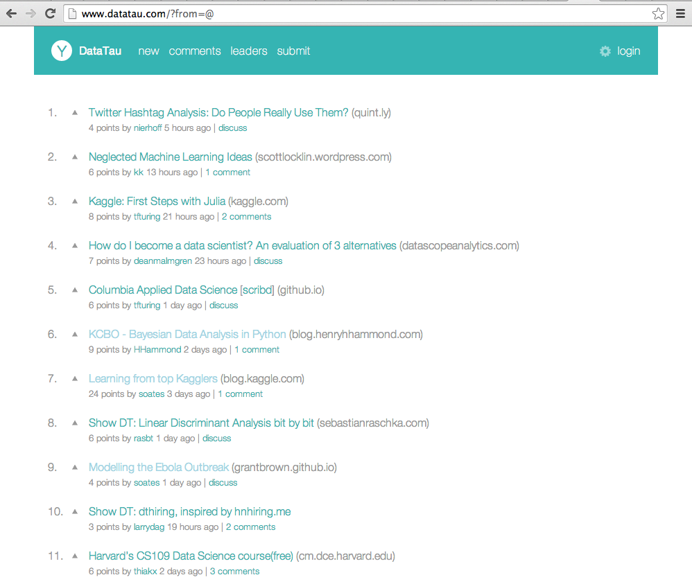

# DT Special — A Data Tau extension

Based (Almost a direct copy) of [the HN special extension](http://gabrielecirulli.github.io/hn-special/).

A theme and extension for [Data Tau](http://datatau.com) that improves the look and feel and adds some interesting features.

The available features can be enabled or disabled based on your personal preference. New feature contributions are welcome!

## Looks

## Features
 - A modern looking visual theme
 - Infinite scrolling
 - Open links in new tab
 - More accurate domain names
 - Comment folding
 - Mark as read (thanks to [@taeram](https://twitter.com/taeram/))
 - Sticky header (thanks to [@obeattie](https://twitter.com/obeattie))
 - Grey visited links (thanks to [@bjenik](https://twitter.com/bjenik))
 - User information tooltips (thanks to sebmck)

#### Potential future features
 - Hide articles with certain keywords

## Installing
This extension hasn't been packaged so please clone this repository and installed the google extension from the developer mode as an unpacked extension.

## Contributing

Please see the [contributing guide &raquo;](CONTRIBUTING.md)

## Notable mentions
Many thanks to [@taeram](https://twitter.com/taeram/), [@obeattie](https://twitter.com/obeattie), [@bjenik](https://twitter.com/bjenik), sebmck and [@messaged](https://twitter.com/messaged) for the contributions!

## License
HN Special is licensed under the [MIT License](LICENSE.txt)
